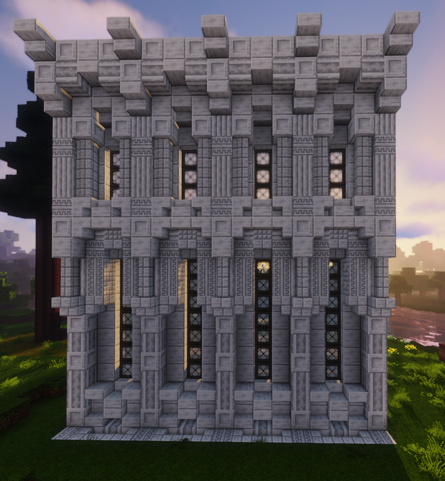

Minecraft, at first glance, seems like a simple Game based on Cubes, which has been around for ages. But it provides aspects for very different topics, such as PvP (Player versus Player fighting), Redstone-related machinery, creating art by building things and many more. In addition to that, the game supports a very active Modding community which adds even more content and functionality, if the base game is not enough for the player. This can be an easy way with getting started in the world of Informatics and Computer Science in general.

# So what have I been up to?

I started playing Minecraft when I was ~ 13 y/o and played occasionally to have fun with friends from school.

Back then [Fraps](https://upload.wikimedia.org/wikipedia/en/thumb/9/99/Fraps_win8.png/330px-Fraps_win8.png) had been a strong contender for recording software and Minecraft versions were shared between friends on USB-sticks which didn't even have more space then 8 GB.

I watched [Jamziboy](https://www.youtube.com/@JamziboyMinecraft/videos), [Jeracraft](https://www.youtube.com/@Jeracraft/videos), [LetsRockMinecraft](https://www.youtube.com/@LetsRockMinecraft/videos), [Adrundaal](https://www.youtube.com/@Adrundaal/videos) and other Youtubers actively but didn't get too involved into the game myself too much back then. Like many others, I started to lose interest in that game and went on to play other things and had different interests.

I came back to the game about 3-4 years ago. I consider myself mainly a builder and modder, but over the years I did some redstone-related things as well.

Current activities:

- Fabric / Quilt Modding for Minecraft 1.18.2 and above
- Building, Terraforming, World Building and other server-preparing activities using World Edit and other tools
- Playing on SMPs and RP servers

## My Builds and Creations

### Creative Builds

<iframe width="560" height="315" src="https://www.youtube.com/embed/S0yq78oAOSs" title="YouTube video player" frameborder="0" allow="accelerometer; autoplay; clipboard-write; encrypted-media; gyroscope; picture-in-picture; web-share" allowfullscreen></iframe>

<iframe width="560" height="315" src="https://www.youtube.com/embed/q3kTLNBw8wE" title="YouTube video player" frameborder="0" allow="accelerometer; autoplay; clipboard-write; encrypted-media; gyroscope; picture-in-picture; web-share" allowfullscreen></iframe>

  

    
  

  

    
  

  

    
  

  

    
  

  

    
  

  

    
  

  

    
  

  

    
  

### SMP Builds

<iframe width="560" height="315" src="https://www.youtube.com/embed/j_GBhbIK-hE" title="YouTube video player" frameborder="0" allow="accelerometer; autoplay; clipboard-write; encrypted-media; gyroscope; picture-in-picture; web-share" allowfullscreen></iframe>

  

    
  

  

    
  

  

    
  

  

    
  

  

    
  

...and a lot more.
